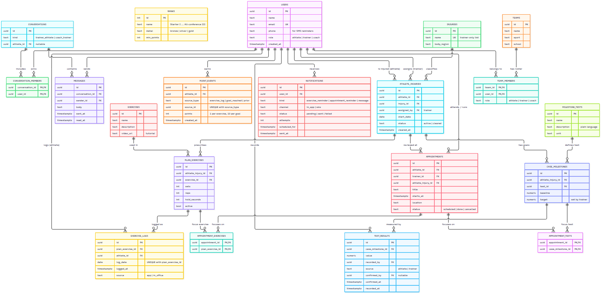

# Comeback

Injury rehab tracker that connects college athletes, their athletic trainer and their coach. Built for IS 401 (BYU, Fall 2026). See `PLAN.md` for the full build plan and `reference/` for the original prototype.

## App Summary

When a college athlete gets hurt, the athletic trainer hands them a rehab plan, but the trainer only sees the athlete at scheduled visits and has no way to know whether the exercises are actually getting done in between. Athletes lose track of what they are supposed to do each day, do not know whether they are on pace to return, and have no easy way to tell the trainer when something hurts. Coaches sit in the dark: they want to know who is available for practice and when, but the trainer cannot share medical details with them. Comeback fixes this by giving each role its own view of one shared record. The trainer assigns an injury, exercises and milestone goals; the athlete logs each exercise with a pain rating, tracks milestone tests, and earns points and rank for consistency; the trainer sees completion, pain flags and messages on a roster; and the coach sees only availability (Out, Limited, Cleared) and an expected return date. Every log, result and message is stored in a Supabase database, so all three people see the same data and nothing resets on refresh.

## ERD



The diagram source is `reference/erd.mmd` (Mermaid). The database is built from it by `supabase/erd_schema.sql`. Two things were added after the diagram was drawn and are in the database but not yet in the image: a `pain` column on `exercise_logs` (0 to 10, required for app logs) and `availability` / `expected_return` columns on `team_members` (what the coach sees). The `notifications` table in the diagram is not created yet because real reminders are out of scope for now.

Core entities and how they relate:

| Entity | What it is | Key relationships |
|---|---|---|
| `users` | One row per person, linked 1:1 to their Supabase login. Role is athlete, trainer or coach. | 1 user : many `team_members`, `exercise_logs`, `messages` |
| `teams` / `team_members` | The roster. Membership decides who can see whom. | many users : many teams (through `team_members`) |
| `athlete_injuries` | One injury case for one athlete, assigned by a trainer. | 1 athlete : many cases; 1 case : many `plan_exercises`, `case_milestones`, `appointments` |
| `exercises` / `plan_exercises` | Catalog of exercises, and the sets/reps prescribed for one case. | many exercises : many cases (through `plan_exercises`) |
| `exercise_logs` | One row each time an athlete marks an exercise done, with a pain rating. Unique per exercise per day. | 1 `plan_exercise` : many logs |
| `milestone_tests` / `case_milestones` / `test_results` | Tests like "One-leg balance", the target set for one case, and each measured value. | 1 milestone : many results |
| `appointments` | Upcoming visits, with the tests and exercises to focus on. | 1 case : many appointments |
| `point_events` / `ranks` | 1 point per exercise logged, 10 per goal reached, awarded by database triggers. Rank thresholds live in `ranks`. | 1 athlete : many point events |
| `conversations` / `messages` | One thread per athlete with the trainer, and one coach-to-trainer thread. | 1 conversation : many messages |

## Tech Stack

| Layer | What we used | Why |
|---|---|---|
| Frontend | React 19 + TypeScript, built with Vite | Smallest setup that still gives component structure and type checking. Vite starts in seconds and hot-reloads. |
| Routing | react-router-dom | Separate URLs for athlete and staff screens, so a role can be sent to its own home. |
| State | React Context + `useReducer` (`src/store`) | No extra library to learn. Loading from and saving to the database lives in one file (`remote.ts`), so the screens never talk to Supabase directly. |
| Business rules | Plain TypeScript functions in `src/domain`, tested with Vitest | Points, streaks, rank and week-completion are pure functions with tests, so we can change thresholds without touching the UI. |
| Backend + database | Supabase (hosted PostgreSQL, Auth, auto-generated REST API) | Backend as a service. Zero server code to write or host, a free tier that covers a class project, and a dashboard where we can see every table and row. Row level security in the database enforces who can see what (a coach can never read an athlete's injury or pain). |
| Automatic rules | PostgreSQL triggers in `supabase/erd_schema.sql` | Points are awarded in the database when a log or result is inserted, so they are correct no matter which screen made the change. |
| Hosting | Vercel (`vercel.json` routes every path to `index.html`) | Free static hosting with a public URL for demos and phone testing. |
| Styling | Plain CSS with variables (`src/styles/tokens.css`) | No UI library. Everything is readable and editable by a team still learning to code. |

Why this fits our team: nobody on the team wanted to run a server, and we needed to see the data to debug it. Supabase gives us a real database and login without an Express layer, and the Table Editor doubles as our admin tool. React with TypeScript was the one frontend stack everyone had touched. The trade-off is less control than a hand-built stack, which we accepted for a semester project.

## How to Get It Running

You need Node.js 20 or newer, npm, and a free Supabase account.

### 1. Get the code

```
git clone https://github.com/bpickard38/ComeBack.git
cd ComeBack
npm install
```

Or click **Code > Download ZIP** on GitHub, unzip it, and run `npm install` inside the folder.

### 2. Create the Supabase project (once per team)

1. At supabase.com, create a new project. Any name and region. Write down the database password.
2. Open **SQL Editor** and run these four files in order. Paste each file's contents into a new query and click Run.
   1. `supabase/erd_schema.sql`: the tables, triggers, security rules and catalogs
   2. `supabase/signup.sql`: roles, teams and join codes
   3. `supabase/live_data.sql`: conversations and plan assignment the screens use
   4. `supabase/demo_data.sql`: the demo team (optional, see Demo accounts)
3. Under **Authentication > Sign In / Providers**, turn on "Allow new users to sign up". Under Email, turn off "Confirm email" unless you want people to confirm by email first.

### 3. Connect the app to your project

1. Copy `.env.example` to `.env.local`.
2. In Supabase, open **Project Settings > API Keys**. Paste the Project URL and the **publishable** key (starts with `sb_publishable_`) into `.env.local`. Never use the secret key.
3. `.env.local` is listed in `.gitignore`, so your keys stay out of the repo.

### 4. Run it

```
npm run dev        # open the address it prints, usually http://localhost:5173
npm test           # business-rule tests (src/domain)
npm run build      # type-check and build into dist/
```

Sign up as a trainer to create a team and get join codes, or use the demo accounts below.

### On your phone

1. Phone and computer on the same Wi-Fi.
2. `npm run dev:phone`
3. Open the `Network:` address it prints (like `http://192.168.1.20:5173`) on your phone. If it does not load, allow Node.js through your firewall for private networks.

## Verifying the Vertical Slice

The button is **Mark done** on the athlete's Today screen. It inserts a row into the `exercise_logs` table, the database trigger adds a point to `point_events`, and the Today screen updates from the saved data.

1. Sign in as the demo athlete Maya Torres (`bpickard38+demo-athlete@gmail.com`, password below). You land on **Today**, which shows a header card like **"0 of 3 done"** and one card per assigned exercise.
2. On the first exercise card, click **Mark done**. A pain scale appears. Pick a number from 0 to 10, then click **Log it**.
3. Watch the UI change: the card's badge flips from "Not done" to "Logged [time]" and shows the pain you picked, a toast confirms "Logged: [exercise] ... Your trainer can see it", and the header now reads **"1 of 3 done"** with the progress bar moved.
4. Refresh the page (F5 or Cmd+R). The header still says **1 of 3 done** and the exercise still shows as logged, because the page reloaded the row from Supabase.
5. To see the row itself, open Supabase **Table Editor > exercise_logs**. The newest row has Maya's `athlete_id`, today's `log_date` and your pain rating. **point_events** has a matching row worth 1 point.
6. To see it from the other side, sign in as the trainer (`bpickard38+demo-trainer@gmail.com`) in a private window. The roster shows Maya's today count as 1 of 3.

What happens under the hood: `Today.tsx` calls `commands.logExercise` in `src/store/AppStore.tsx`, which checks the business rules (not already logged today, pain rating present, not offline) and then calls `insertLog` in `src/store/remote.ts`, which runs `supabase.from('exercise_logs').insert(...)`. If the insert succeeds, the new log is added to app state and the screen re-renders. On the next page load, `remote.ts` reads `exercise_logs` back from Supabase, so the log is still there.

Each exercise can only be logged once per calendar day (a unique constraint in the database). To run the demo again the same day, run `supabase/demo_data.sql` again, which resets the demo team.

## Demo accounts

All use the password `ComebackDemo2026!`. These are throwaway demo logins, not real credentials; no project keys are stored in the repo. The `+demo-...` addresses all deliver to the owner's Gmail.

| Who | Role | Email |
|---|---|---|
| Maya Torres | Athlete (ankle sprain, the main demo athlete) | `bpickard38+demo-athlete@gmail.com` |
| Jordan Reyes | Athlete (ACL, out) | `bpickard38+demo-jordan@gmail.com` |
| Devon Clarke | Athlete (shoulder, pain flagged, sent a message) | `bpickard38+demo-devon@gmail.com` |
| Priya Nair | Athlete (hamstring, cleared) | `bpickard38+demo-priya@gmail.com` |
| Sam Rivera | Athletic trainer | `bpickard38+demo-trainer@gmail.com` |
| Coach Lee | Coach | `bpickard38+demo-coach@gmail.com` |

They are all on the "Demo Soccer" team. **Run `supabase/demo_data.sql` again the morning of a demo**: it resets the demo team to fresh data dated around today (the last three days of logs, this week's retests, visits in the next two weeks). It only touches these accounts.

If the accounts ever get deleted, sign up again in the app with the same emails, names and roles, then run `demo_data.sql`.

## Accounts and teams

- Anyone can create an account as an athlete, coach or athletic trainer. The role picks which screens they see.
- A trainer creates a team and gets two join codes (shown on their home screen): one for athletes, one for coaches.
- Athletes and coaches enter their code to join. A code only works for its role, so nobody can join as staff with an athlete code.
- What anyone can see is decided in the database by team membership, not by the role they picked.

## Full demo script

Use the demo accounts above. To show two roles side by side, sign in to the second one in a private browser window. Changes show up for the others within 30 seconds, or right away with "Refresh data".

1. **Athlete (Maya)**: on Today, tap "Mark done" on the three pending exercises and pick a pain rating for each. The last one ranks her up to Varsity I. Rate one a 7 and message your trainer about it.
2. **Progress**: log 30 for One-leg balance. The card flips to "Goal reached" and adds 10 points.
3. **Trainer**: Maya and Devon are flagged for pain and a new message. Reply to Maya (her flag clears), set Devon to Out with a return date, and assign Jordan new exercises.
4. **Coach**: "Team availability" shows only Out / Limited / Cleared and return dates, no injuries. Message the trainer, then show it under "From coach" on the trainer's screen.
5. **Errors**: set "Connection: offline" and try logging; tap "Edit my plan"; log without a pain rating; save an empty result or message.
6. **Sign-up**: create a new athlete account and join with the athlete code from the trainer's "Join codes" card. Try the coach code first to show it is refused.

## Where things live

| Folder | What is in it |
|---|---|
| `src/domain` | Rules as plain functions (points, streaks, rank, week %), with tests. No React. |
| `src/data` | Sample data (`seed.ts`) used by the tests |
| `src/store` | Sign-in gate, loading from and saving to Supabase (`remote.ts`), app state, and the commands screens call |
| `supabase` | Database setup scripts (run in order, see above) |
| `src/components` | Reusable pieces: Button, Card, ProgressBar, Toast, TabBar, trophy icons |
| `src/screens` | Athlete and staff screens |
| `src/styles` | `tokens.css` (colors, fonts, sizes), `global.css`, `screens.css` |
| `reference` | The ERD (`erd.mmd`, `erd.png`) and the original clickable prototype |
